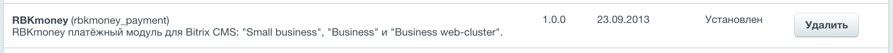
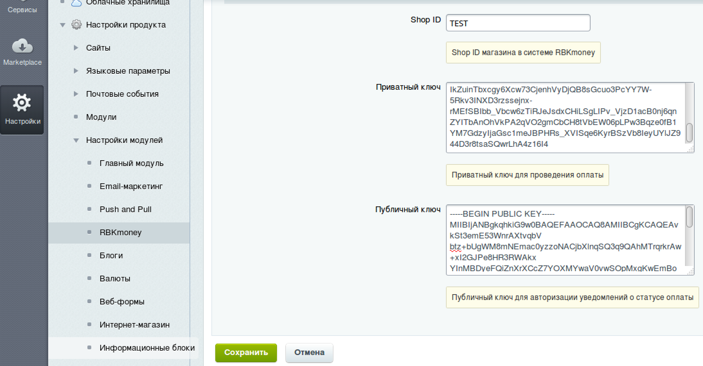
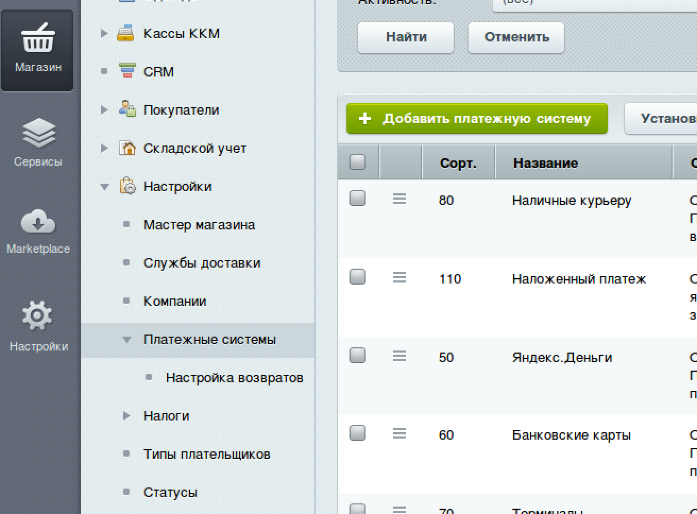
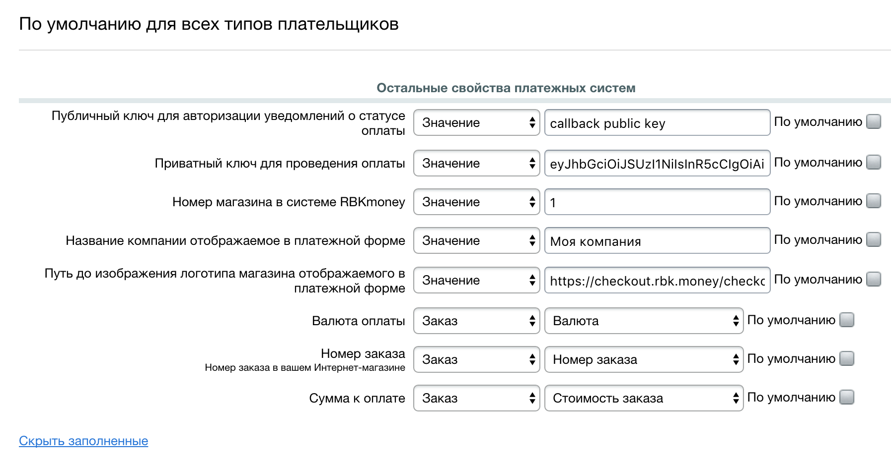

# rbkmoney-cms-bitrix

Пожалуйста, обязательно делайте бекапы!

Модуль разрабатывался и тестировался на версии bitrix: 17.5.7


### Установка и настройка модуля

1) Скопируйте папку `rbkmoney_checkout` и все ее содержимое на ваш сервер в `\bitrix\modules\`
2) В "Настройки / Настройки продукта / Модули / Управление модулями" найдите модуль `«RBKmoney (rbkmoney_checkout)` и установите его.


В поля «Публичный ключ для авторизации уведомлений о статусе оплаты», «Приватный ключ для проведения оплаты», «Номер магазина в системе RBKmoney» заполните данными из Личного Кабинета Мерчанта https://dashboard.rbk.money




1. Перейдите в «Настройки» -> «Настройки модулей» -> «RBKmoney»
2. Заполните основные настройки для работы модуля



`Shop ID` - идентификатор магазина из RBKmoney.
Скопируйте его в Личном кабинете RBKmoney в разделе `Детали магазина`, поле `Идентификатор`;

`Приватный ключ` - ключ для доступа к API.
Скопируйте его в Личном кабинете RBKmoney в разделе `API Ключ`

`Публичный ключ` - ключ для обработки уведомлений о смене статуса
- Заходим в личный кабинет RBKmoney: `Создать Webhook`;
- Вставляем в поле URL вида `https://<your-bitrix-site>/personal/order/rbkmoney_checkout/notification.php`
- Выбираем Типы событий `InvoicePaid` и `Invoice Canсelled`;
- после создания Webhook-а копируем `Публичный ключ` после нажатия `Показать детали`;
скопированный ключ вставляем в поле `Публичный ключ` на странице настроек модуля;


1) Перейдите в «Магазин» -> «Платежные системы» и нажмите на кнопку «Добавить платежную систему»


2) Выберите RBKmoney и заполните данные в открывшемся окне:




3)	Заполните оставшиеся поля и нажмите кнопку «Применить»

Все запросы и ответы логируются, с ними можно ознакомиться в разделе `Журнал событий`


### Нашли ошибку или у вас есть предложение по улучшению модуля?

Пишите нам support@rbkmoney.com При обращении необходимо:

- Указать наименование CMS и компонента магазина, а также их версии
- Указать версию платежного модуля (доступна на странице Усправление пакетами)
- Описать проблему или предложение
- Приложить снимок экрана (для большей информативности)


### Возможные нюансы

#### Не открывается платежная форма на странице заказов

---
Если по какой-то причине у вас при нажатии на кнопку "Оплатить" не открывается платежная форма RBKmoney на странице
```
http://<your-bitrix-site>/personal/orders/
```

То вам необходим поставить галочку в настройках платежной системы "Открывать в новом окне" и почистить кэш.


---


#### Проблемы с кодировкой файлов

Если у вас возникли проблемы с кодировкой файлов, например, у вас кодировка Windows-1251.

То вы можете воспользоваться любой программой по смене кодировки файла, чтобы перевести файлы модуля в нужную вам кодировку


#### Проблемы с Webhook-ами

### Webhook возвращает http code 200, но статус не обновляется

Это связано с тем, что доступ к странице для обработки Webhook-а требует ввода логина и пароля.
Вам нужно добавить страницу для обработки webhook-а в исключение, чтобы при обращении к ней не выводилась форма авторизации.


### При получении Webhook-а отсутствует тело сообщения, но есть подпись

Все дело в 301 редиректе на вашей стороне, который прокидывает заголовки, но не пробрасывает тело сообщения.
Страница для обработки Webhook-а должна быть доступна без каких-либо редиректов на нее.
